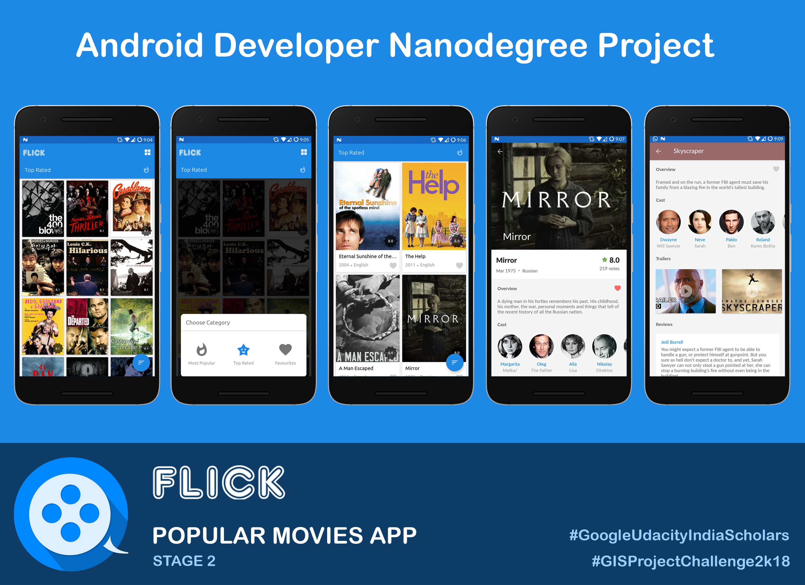

# Flick
> Android app that shows popular and top rated movies using the 'themoviedb.org' API

Movie thumbnails show up in a grid format and can be sorted according to a category. Selecting a movie will show its details. The application uses Room data persistence library for storing favorite movies along with LiveData and ViewModel. This project was done as a part of Android Developer Nanodegree Program.

## App Walk-through
https://www.youtube.com/watch?v=b1pYHuNXjEQ

## How to use

In gradle.properties file, themoviedb API Key needs to be added with the name `movieDbApiKey`. Go to https://www.themoviedb.org/ to get the API Key.

``movieDbApiKey="Your API Key here"``

## License

This project is licensed under the MIT License. See the [LICENSE.md](/LICENSE) file for details
